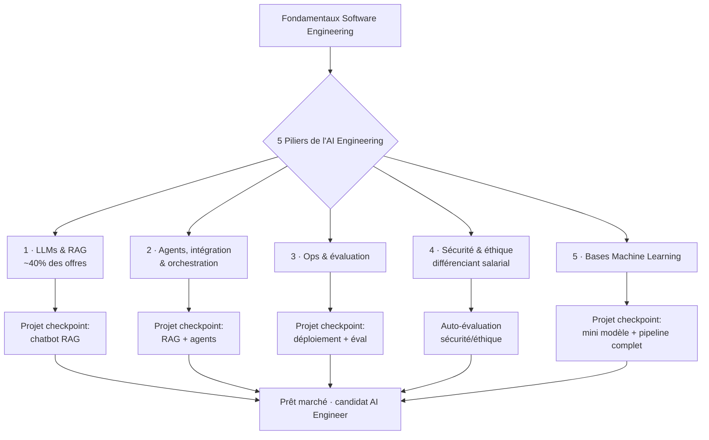

# 🧭 Feuille de route — Devenir Ingénieur IA (2026)

> Synthèse structurée d'une vidéo roadmap "AI Engineer 2026". Contenu reformulé et organisé pour usage Obsidian/VS Code.

---

## 0. Contexte

Le poste "AI Engineer" existe depuis moins de 24 mois. Ce n'est **pas un métier autonome** : c'est une extension du software engineering classique.

| Profil | Recommandation |
|---|---|
| 0 an d'XP software eng. | Acquérir d'abord les fondamentaux SWE avant de se spécialiser IA |
| 2–5 ans XP SWE | **Sweet spot** — le marché est ouvert, forte demande |
| < 2 ans XP | Postes juniors rares, mais accessibles avec un bon projet |
| 6–8+ ans XP | Avantage technique fort, mais transition plus rare (confort de poste) |

---

## 1. Vue d'ensemble — les 5 piliers

---

## 2. Détail par pilier

### Pilier 1 — LLMs & RAG

| Étape | Objectif |
|---|---|
| Fondamentaux LLM | Comprendre architecture transformer, tokenisation, fine-tuning (ex. cours Hugging Face LLM Course) |
| Prompt & context engineering | System prompts, gestion du contexte, pas juste du "prompting chatbot" |
| APIs LLM | Pratique avec API Claude / OpenAI / Gemini en Python |
| Embeddings & recherche sémantique | Word embeddings, word2vec, similarité vectorielle |
| Bases vectorielles | Choix et usage d'une vector DB pour la recherche |
| RAG de base | Pipeline retrieval → augmentation → génération |
| Chunking avancé | Stratégies de découpage de documents (niveaux de "text splitting") |
| RAG avancé | Hybrid RAG, agentic RAG |
| **Checkpoint** | Construire un chatbot RAG (idéalement hybride) |

### Pilier 2 — Agents, intégration & orchestration

| Étape | Objectif |
|---|---|
| Agent à outils (tool-use) | Premier agent capable d'appeler des fonctions/outils |
| Sortie structurée | Validation de sortie LLM (type Pydantic / instructor) |
| Frameworks LLM | Approfondissement LangChain pour apps agentiques |
| Fondamentaux agents | Ce qu'est un agent, comment il raisonne |
| Design patterns agentiques | Connaître les grandes familles de patterns (essentiel — construire un agent est facile, bien le concevoir ne l'est pas) |
| Orchestration | LangGraph pour orchestrer des flux multi-étapes |
| Systèmes multi-agents | Frameworks type CrewAI |
| Mémoire d'agent | Mémoire court terme vs long terme |
| Agentic RAG | Fusion agents + retrieval |
| Protocoles (MCP) | Comprendre le rôle d'un protocole d'intégration outils/serveurs |
| **Checkpoint** | Ajouter des agents à ton projet RAG existant |

### Pilier 3 — Ops & évaluation

| Étape | Objectif |
|---|---|
| LLMOps | Spécificité: contrairement au SWE classique, l'ops/eval est **de la responsabilité directe** de l'AI engineer |
| Serving de modèles open-source | Inférence rapide, infra de serving |
| Observabilité & monitoring | Traçage des appels LLM en production |
| CI/CD pour applications LLM | Pipelines de déploiement continu |
| Méthodes d'évaluation | Frameworks d'éval génériques, LLM-as-judge |
| Évaluation RAG | Métriques spécifiques (type RAGAS) |
| Évaluation d'agents | Évaluer un comportement multi-étapes, pas juste une sortie |
| Benchmarking | Comprendre à quoi servent les benchmarks de modèles |
| **Checkpoint** | Déployer et évaluer le projet des piliers précédents |

### Pilier 4 — Sécurité & éthique

| Étape | Objectif |
|---|---|
| IA responsable | Panorama des principes (type Google Cloud Responsible AI) |
| Éthique des données & biais | Comprendre les sources de biais dans les données/modèles |
| Sécurité & risques LLM | Vecteurs d'attaque spécifiques aux LLM |
| Red teaming | Test offensif d'une application LLM (optionnel si hors sécurité) |
| Guardrails | Frameworks de garde-fous (type NeMo Guardrails), prévention de l'injection de prompt |
| Gouvernance IA | Panorama réglementaire (notamment UE) |
| **Checkpoint** | Auto-test façon "entretien sécurité/éthique" avec un LLM comme examinateur |

> 💡 Pilier différenciant : peu de candidats l'approfondissent, fort impact sur le niveau de rémunération.

### Pilier 5 — Bases Machine Learning

| Étape | Objectif |
|---|---|
| Fondamentaux ML | Biais/variance, notions de base (max ~3 mois, ne pas viser l'expertise ML pure) |
| Scikit-learn | Prise en main pratique |
| Qualité & ingénierie des données | ETL/ELT, validation de données |
| Tracking d'expériences | MLflow |
| Cycle de vie modèle | Staging → production |
| Versioning de données | DVC |
| CI/CD ML | Automatisation via GitHub Actions |
| Monitoring ML en prod | Cycle de vie du monitoring, structuré vs non structuré |
| **Checkpoint** | Mini-modèle → RAG → agent → évaluation → déploiement (projet intégrateur final) |

---

## 3. Parcours selon ton profil

| Profil | Priorité |
|---|---|
| Étudiant / débutant sans XP | Construire un **projet portfolio à fort impact** avant tout |
| Déjà SWE / data engineer / data analyst | Repositionner CV, LinkedIn et intitulés vers "AI Engineer" (sans mentir, mais en valorisant les éléments IA existants) |

## 4. Spécificités entretien AI Engineer

- Moins de LeetCode pur.
- Plus de **system design** orienté IA.
- Coding assisté par IA en live.
- Work trials plus fréquents.

## 5. Checklist actionnable

- [ ] Fondamentaux SWE validés
- [ ] Pilier 1 — LLMs & RAG + projet checkpoint
- [ ] Pilier 2 — Agents/orchestration + projet checkpoint
- [ ] Pilier 3 — Ops & évaluation + projet checkpoint
- [ ] Pilier 4 — Sécurité & éthique + auto-évaluation
- [ ] Pilier 5 — Bases ML + projet intégrateur final
- [ ] CV / LinkedIn repositionnés "AI Engineer"
- [ ] Prép entretien system design + coding assisté IA
- [ ] Candidatures + relances actives
