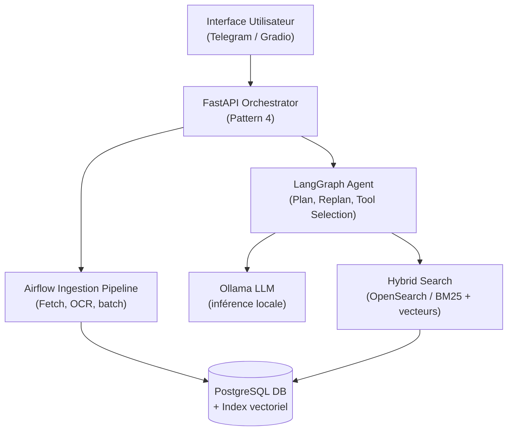

# Mother of AI — Curator arXiv
## Architecture & Feuille de Route Agentique

---

## 1. Vision : du Chatbot à l'Agent

| Niveau | Métaphore | Comportement |
|---|---|---|
| Chatbot | Le perroquet à l'accueil | Récite des fiches par cœur |
| RAG classique | Le bibliothécaire | Va chercher les bons livres selon une requête simple |
| Agent (Agentic RAG) | Le Directeur de Recherche | Planifie des revues de littérature, orchestre des outils, contrôle les résultats, ajuste sa mémoire |

---

## 2. Matrice des 5 Patterns Agentiques

| Pattern | Rôle système | Composant technique clé |
|---|---|---|
| 1. Tool Use | Interagir avec des systèmes externes via API | Function calling (JSON typé), FastAPI, LlamaIndex |
| 2. Reflection | Évaluation critique et auto-correction | Boucle Generate/Evaluate, RAGAS, assertions |
| 3. Plan & Execute | Décomposition stratégique et replanification | Airflow DAG, LangGraph Planner, Query Decomposition |
| 4. Orchestrator/Worker | Délégation hiérarchique, contexte isolé | Master Agent + Sub-Agents, Celery/Python Workers |
| 5. Memory & Context | Gestion sélective mémoire court/long terme | OpenSearch, PostgreSQL, Chunking sémantique |

---

## 3. Architecture Technique

---

## 4. Déclinaison par Pattern

### 🛠️ 1. Tool Use — donner des mains au LLM

Le LLM (Ollama) ne se limite plus à générer du texte : via FastAPI + LlamaIndex, il appelle des outils typés.

| Outil | Fonction |
|---|---|
| `outil_recherche_hybride` | Interroge OpenSearch (BM25 + vecteurs) |
| `outil_filtre_metadonnees` | Filtre PostgreSQL (année, auteur…) |

**Saut agentique (semaine 7)** : avec LangGraph, le LLM *décide* quel outil appeler — relance la recherche si le contexte est insuffisant, vérifie un auteur en base si besoin.

---

### 👅 2. Reflection — auto-correction et validation

| Mécanisme | Rôle |
|---|---|
| Re-ranking | Évalue et filtre les chunks avant de les transmettre au LLM (le "goûteur") |
| RAGAS + Langfuse | Mesure asynchrone : Faithfulness, Context Precision, Answer Relevancy |
| Fallback OCR | Si le parsing PDF échoue, bascule automatique sur extraction OCR |
| User Feedback | Collecté via Langfuse, alimente l'évaluation globale et le futur fine-tuning |

---

### 📋 3. Plan & Execute — décomposer la complexité

**Airflow DAG** (ingestion) :

| Étape | Action |
|---|---|
| Plan | Métadonnées → Téléchargement → Extraction → Chunking → Vectorisation |
| Execute | Chaque étape exécutée séquentiellement |
| Replan | Papier corrompu → erreur isolée, le reste du batch continue |

**Query Decomposition** (semaine 7) — ex. *"Compare les approches Transformers entre 2022 et 2024"* :
1. Recherche "Transformers 2022"
2. Recherche "Transformers 2024"
3. Synthèse des deux résultats

---

### 🎼 4. Orchestrator / Worker — déléguer à l'échelle

| Composant | Rôle |
|---|---|
| FastAPI | Orchestrateur web — reçoit la requête, délègue de façon async |
| LangGraph | Master Agent — délègue à des sub-agents (recherche, synthèse, vérification) |
| Celery / Python Workers | Exécutent les tâches lourdes (téléchargement arXiv, OCR) sans bloquer l'API |

**Bénéfice** : contexte isolé par worker → pas de saturation du LLM avec des informations inutiles.

---

### 📖 5. Memory & Context Management — ne pas saturer

| Type de mémoire | Implémentation | Rôle |
|---|---|---|
| Working Memory | Context Builder — Top-K chunks + Prompt Template | Mémoire immédiate, limitée par la fenêtre de contexte d'Ollama |
| Long-Term (sémantique) | OpenSearch / PostgreSQL | Millions de chunks vectorisés, chargés sélectivement via Hybrid Search |
| Chunking sémantique | Découpage par section / paragraphe | Compression de mémoire — un mauvais chunking sature le LLM de bruit |
| Episodic Memory | Historique de fil Telegram | Traite les questions de suivi contextualisées |

---

## 5. Feuille de Route

| Phase | Livrables techniques | Patterns couverts |
|---|---|---|
| Semaines 1–3 | Pipeline Airflow, modélisation PostgreSQL/OpenSearch, endpoints FastAPI de base | Ingénierie classique (aucun pattern agentique) |
| Semaines 4–5 | Chunking sémantique, intégration LlamaIndex/Ollama, recherche hybride | Memory (retrieval) + Tool Use basique |
| Semaine 6 | Langfuse, métriques RAGAS, fallback OCR | Reflection |
| Semaine 7 | LangGraph, décomposition de requêtes, bot Telegram persistant | Plan & Execute + Orchestrator/Worker → **Agentic RAG complet** |

---

## 6. Grille d'Évaluation avant Production

| # | Pattern | Critère go/nogo |
|---|---|---|
| 1 | Tool Use | Arguments d'appel avec schéma strict et validé (Pydantic / JSON Schema) ? |
| 2 | Reflection | Validation basée sur des assertions/métriques fermées, pas sur une auto-évaluation du LLM ? |
| 3 | Plan & Execute | Replanification autonome en cas d'échec d'une sous-tâche ? |
| 4 | Orchestrator/Worker | Isolement de contexte par worker — pas de transfert excessif d'info inutile ? |
| 5 | Memory | Filtres d'élagage à l'écriture en mémoire long terme, pour éviter la saturation ? |

---

## Synthèse

Jusqu'à la semaine 6 : construction de la **tuyauterie** (pipeline, API, mémoire, tool use basique) — indispensable, car un agent sans bons outils ni bonne mémoire est inutile.

À la semaine 7, LangGraph greffe le **cerveau agentique** (Reflection, Plan & Execute, Orchestrator/Worker) sur cette tuyauterie. Le projet passe de "moteur de recherche intelligent" à "Assistant de Recherche IA".
