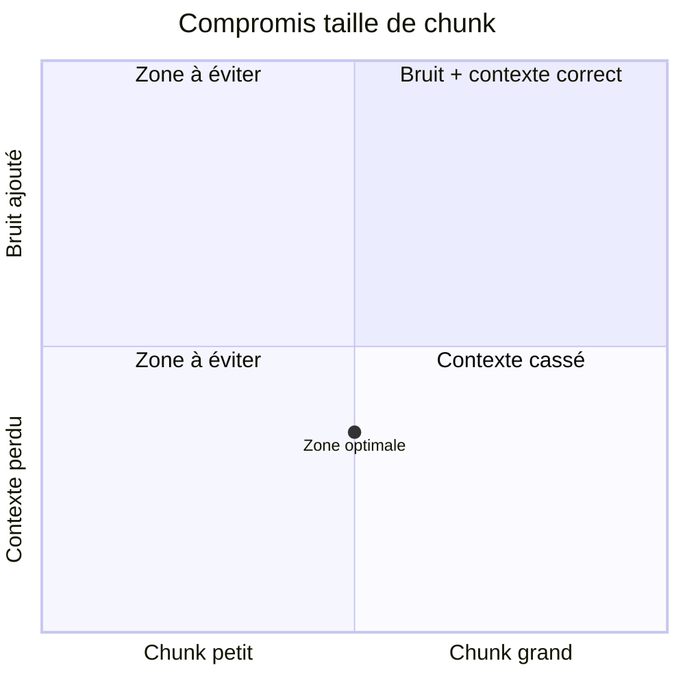
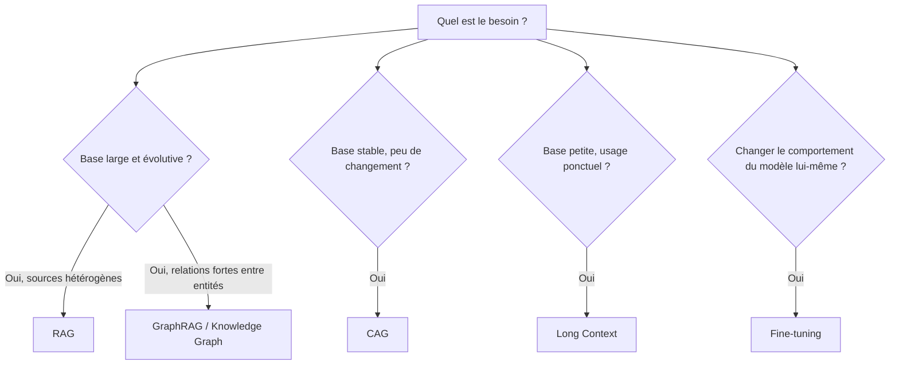
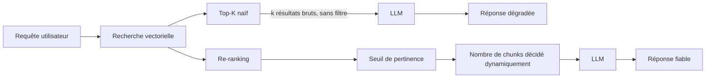
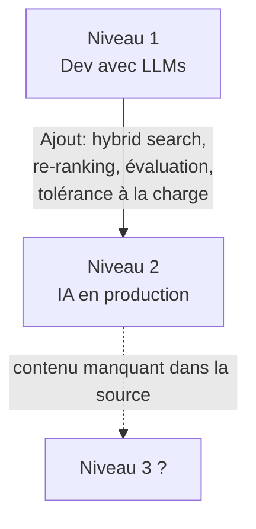

# 🎯 Cours — RAG en production : au-delà des bases

> Complément au module "LLMs & RAG" de la feuille de route AI Engineer 2026 — synthèse de plusieurs extraits techniques.

---

## 1. Chunking — le levier le plus sous-estimé

Une mauvaise stratégie de chunking suffit à casser un système RAG entier.

| Taille de chunk | Symptôme | Conséquence |
|---|---|---|
| Trop grande | Le chunk contient la bonne info + du bruit | Le LLM reçoit du contexte non pertinent, réponse diluée |
| Trop petite | Le chunk coupe une idée en plein milieu | Perte de cohérence, contexte insuffisant pour répondre |
| Bien calibrée | Assez petite pour la précision, assez grande pour le sens | Meilleur compromis retrieval / compréhension |

> ⚠️ Il n'existe pas de taille universelle : c'est un paramètre à itérer empiriquement sur ton corpus (cf. discipline TDD / preuve empirique).

---

## 2. Choisir la bonne technique selon le besoin

Toutes les questions RAG ne se résolvent pas avec du RAG classique.

| Besoin | Technique recommandée |
|---|---|
| Sources externes hétérogènes, base de connaissances large | **RAG** (retrieval vectoriel classique) |
| Base de connaissances avec relations fortes entre entités | **GraphRAG / Knowledge Graphs** |
| Modifier durablement le comportement ou le style du modèle | **Fine-tuning** |
| Base de connaissances stable, peu de changements | **CAG** (Cache-Augmented Generation) |
| Base de connaissances petite, usage ponctuel | **Long Context** (tout injecter directement) |

---

## 3. Le piège du Top-K

La plupart des RAG basiques utilisent le **retrieval top-k** : après recherche vectorielle, on garde les *k* meilleurs résultats et on les envoie tels quels au LLM.

**Exemple** — requête : *"combien de jours de congés ai-je ?"*

| Résultat retrouvé | Score similarité | Pertinent ? |
|---|---|---|
| "15 jours de congés payés / an" | 0.92 | ✅ Oui |
| "Jours fériés de l'entreprise" | 0.87 | ❌ Hors sujet |
| "10 jours de RTT" | 0.61 | ⚠️ Ambigu |
| "Procédure de validation des congés" | 0.56 | ❌ Hors sujet |
| "Validation par le manager" | 0.51 | ❌ Hors sujet |

Avec `k = 5`, ces 5 résultats sont envoyés en bloc au LLM — y compris ceux qui sont hors-sujet ou obsolètes. Le LLM mélange alors bonnes et mauvaises informations, et la réponse finale en pâtit.

**Solutions RAG production :**
- **Re-ranking** des résultats après la recherche vectorielle initiale
- **Seuil de pertinence (threshold)** : écarter tout ce qui est sous un score minimal
- **Sélection dynamique** du nombre de chunks à envoyer, plutôt qu'un `k` fixe

---

## 4. Les niveaux de maturité en ingénierie IA

| Niveau | Caractéristiques | Limite |
|---|---|---|
| **1 — Développement avec LLMs** | Appel direct d'API (OpenAI, Anthropic), RAG simple, maîtrise de prompting / embeddings / context window / tokens | Suffisant pour prototyper, pas pour la production |
| **2 — Ingénierie IA en production** | Recherche hybride + re-ranking, évaluation continue de la qualité de retrieval, tenue de charge (milliers d'utilisateurs), gestion des pannes | La majorité des praticiens plafonnent avant ce niveau |
| **3 — non détaillé dans la source** | — | ⚠️ L'extrait fourni s'interrompt avant de décrire ce niveau |

---

## Synthèse actionnable

- [ ] Traiter le chunking comme un paramètre à tuner empiriquement, pas une constante
- [ ] Choisir la technique (RAG / GraphRAG / CAG / Long Context / Fine-tuning) **selon le besoin**, pas par défaut
- [ ] Remplacer un top-k fixe par re-ranking + seuil + sélection dynamique
- [ ] Situer honnêtement son système sur l'échelle niveau 1 → niveau 2 avant de viser la production
